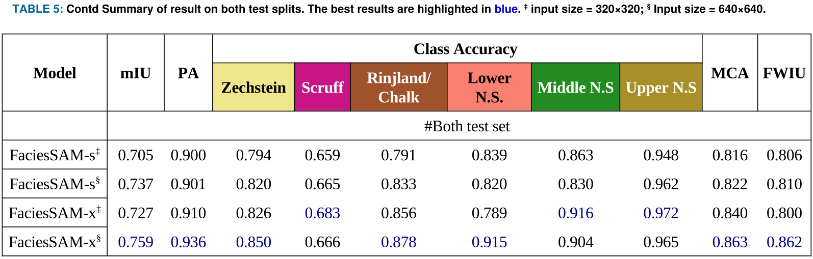

# Towards User-Guided Seismic Facies Interpretation with a Pre-trained Large Vision Model

## Architecture


## Dataset
- All data used for training, validating and testing can be downloaded [here](https://drive.google.com/drive/folders/1Hx4BwVMhB4ElkggcKbc60UexywIEo9UL?usp=sharing). 

- The `data` directory should have this structure: 
```text
  data   
    ├── sa.yaml
    ├── images
    │    ├── train
    │    │    ├── image_inline_300.jpg
    │    │    └── ...
    │    ├── val
    │    │    ├── test1_image_inline_100.jpg
    │    │    └── ...
    │    └── test
    │         ├── test2_image_inline_100.jpg
    │         └── ...
    └── labels
    |    ├── train
    |    │    ├── image_inline_300.txt
    |    │    └── ...
    |    ├── val
    |    │    ├── test1_image_inline_100.txt
    |    │    └── ...
    |    └── test
    |    |    ├── test2_image_inline_100.txt
    |    |    └── ...
    |    └── test.cache
    |    |
    |    └── train.cache
    |    |
    |    └── val.cache   
    └── masks
        ├── train
        │    ├── image_inline_300.png
        │    └── ...
        ├── val
        │    ├── test1_image_inline_100.png
        │    └── ...
        └── test
            ├── test2_image_inline_100.png
            └── ...
```
## Requirements
Install requirements
```shell
pip install -r requirements.txt
pip install git+https://github.com/openai/CLIP.git
```
+ +NVIDIA GPU + CUDA CuDNN
+ +Linux (Ubuntu)
+ +Python v3.10

## Model Checkpoints
FaciesSAM has four variants:
- FaciesSAM-s-320.pt: trained on image size of 320 and has 12M parameters
- FaciesSAM-s.pt: trained on image size of 640 and has 12M parameters 
- FaciesSAM-x-320.pt: trained on image size of 320 and has 72M parameters
- FaciesSAM-x.pt: trained on image size of 640 and has 72M parameters

All model checkpoints can be accessed [here](https://drive.google.com/drive/folders/17aGBTfwzZJOMS5jT2QkVEQ-m9SqpQWW1). **Note**: `FaciesSAMv2.pt` is based on `YOLOv9c-seg`  
## Get the validation/test instance segmentation results
Open a terminal and run
```shell
python test_instance.py\
        --model_path 'models/FaciesSAM-x.pt'\ # model trained on image size of 640
        --cfg 'data/sa.yaml'\
        --split 'val'\
        --img_sz 640 # Image size can either be 320 or 640
```
This automatically create a new directory called `run`. Navigate to see results
<div style="display:table-cell; vertical-align:middle; text-align:center; width:90cm">
        
</div>

##  Get the validation/test semantic segmentation results
Open terminal and run
```shell
python test_semantic.py\
        --model_path 'models/FaciesSAM-x.pt'\
        --data_path 'data/sa.yaml'\
        --split 'test'\
        --img_sz 640  # Image size can either be 320 or 640
```
This automatically create a new directory called `run`. Navigate to see results


## How to train FaciesSAM on your dataset
Open terminal and run
```shell
python train.py \
        --model_path 'models/FaciesSAM-x.pt' \
        --cfg 'data/sa.yaml' \
        --aug True \
        --num_freeze 0 \
        --epochs 100 \
        --bs 16 \
        --img_sz 640 # Image size can either be 320 or 640

```
This automatically create a new directory called `run`. Navigate to see results

## Interact with seismic image through prompt action
Navigate to the `app` directory to see how FaciesSAM+CLIP can allow you interact with seismic images 

## Citation
```text
@article{atolagbe2025faciessam,
  title={Towards User-Guided Seismic Facies Interpretation with a Pre-trained Large Vision Model},
  author={Joshua Atolagbe and Ardiansyah Koeshidayatullah},
  journal=IEEE Access,
  year={2025}
}
```
## Credit
The codes in this repository are based on [FastSAM](https://github.com/CASIA-IVA-Lab/FastSAM/tree/main) and [Ultralytics](https://github.com/ultralytics/ultralytics)